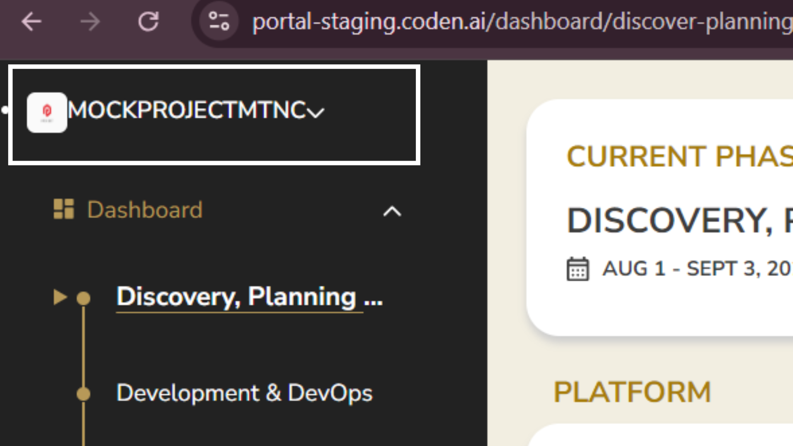

**Bug ID:** CPRTL-500  
**Severity:** Low  
**Priority:** Low  
**Project:** Coden Portal  
**Environment:** Staging

---

### Title:
[Sidebar | Profile] Project Profile and Name Elements Are Visually Cramped

### Description:
In the sidebar section, the project profile and name elements are displayed too closely together without sufficient spacing. This causes a cramped layout and reduces readability and visual clarity of the UI.

### Steps to Reproduce:
1. Open Coden Portal in staging.  
2. Navigate to sidebar profile.  
3. Observe the project profile and project name section.  
4. Check spacing between the elements.  

### Expected Result:
Project profile and project name should have proper spacing and visual separation to maintain readability and UI consistency.

### Actual Result:
Project profile and project name appear too close together, resulting in a cramped and visually compressed layout.

### Evidence:

### Notes:
Likely related to CSS spacing (margin/padding) or layout container styling in the sidebar component.
