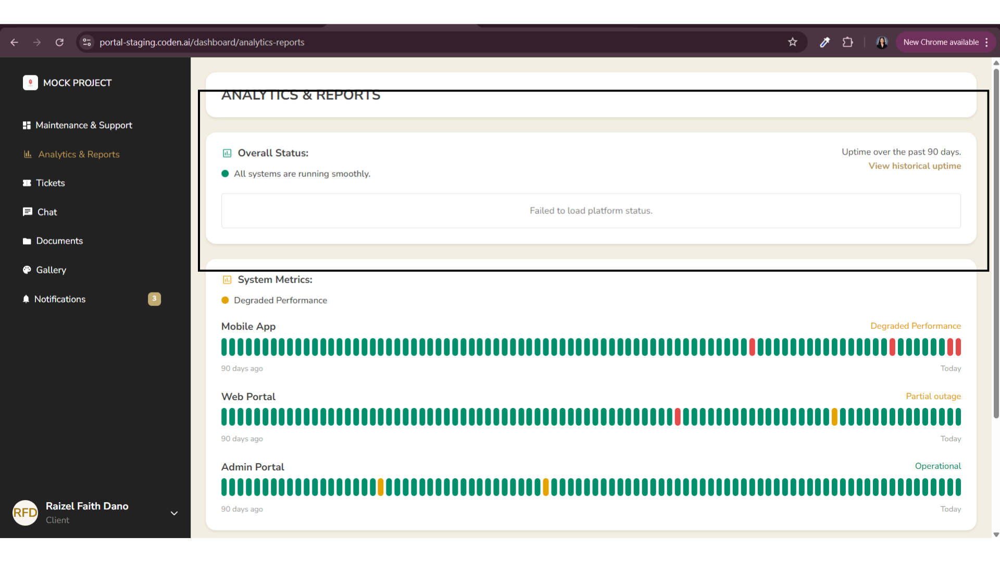

**Bug ID:** CPRTL-501  
**Severity:** High  
**Priority:** High  
**Project:** Coden Portal  
**Environment:** Staging  

---

### Title:
[Analytics & Reports | Overall Status] Platform Status Fails to Load Despite Multiple Refresh Attempts

### Description:
In the Analytics & Reports section under Overall Status, the platform status fails to load even after multiple refresh attempts. This prevents users from viewing system-wide status metrics and overall platform health information.

### Steps to Reproduce:
1. Open Coden Portal in staging environment.
2. Navigate to Analytics & Reports.  
3. Go to Overall Status section.  
4. Attempt to load the platform status view.  
5. Refresh the page multiple times if necessary.  
6. Observe the loading behavior and final state.  

### Expected Result:
Platform status should load successfully and display overall system metrics and health status.

### Actual Result:
Platform status fails to load even after multiple refresh attempts.

### Evidence:

