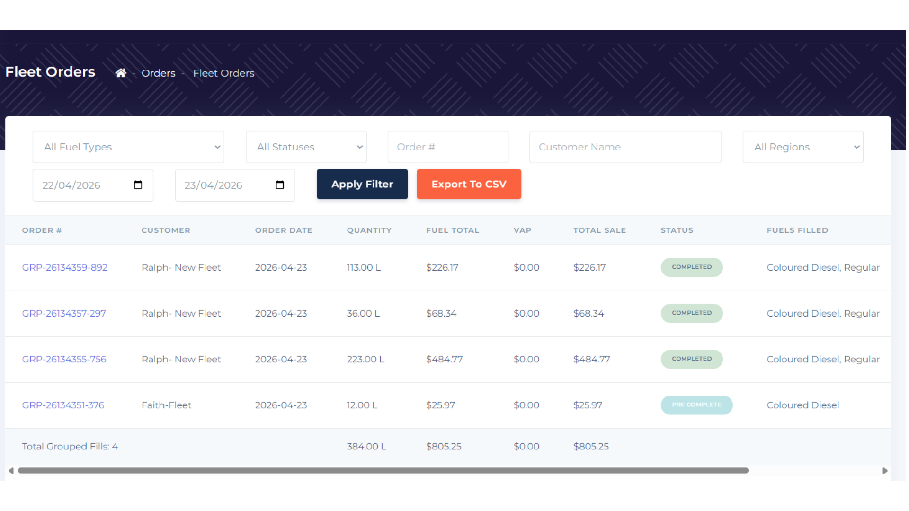

**Bug ID:** REF-2471  
**Severity:** Low  
**Priority:** Low  
**Project:** ReFuel  
**Environment:** Staging  

---

### Title:
Pre-Complete Status Badge Color Inconsistent with Orders Page  

### Description:
Pre-Complete badge uses incorrect styling instead of consistent UI styling.

### Steps to Reproduce:
1. Open Admin Portal
2. Navigate to sidebar banner 
3. Open Orders page
5. Locate Pre-Complete status
6. Compare with other pages

### Expected Result:
Consistent badge styling across all pages.

### Actual Result:
Background mismatch observed on Pre-Complete banner.

### Evidence:

### Notes:
UI theming inconsistency.
