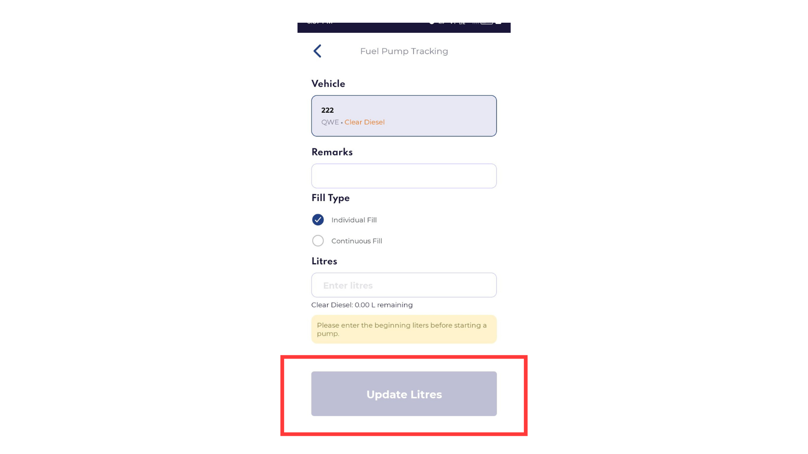

**Bug ID:**  REF-2471   
**Severity:** Low   
**Priority:** Low   
**Project:** ReFuel   
**Environment:** Staging   

---

### Title:
Fuel Pump Tracking Button Shows Incorrect Label (“Update Meter”)

### Description:
Button label does not reflect correct action.

### Steps to Reproduce:
1. Login to Mobile Driver App
2. Navigate to Commercial
3. Open Fuel Pump Tracking
4. Attempt to update liters

### Expected Result:
Button should display “Update Liters”.

### Actual Result:
Button shows “Update Meter”.

### Evidence:
(Resolved pic only is available)

### Notes:
Minor UI text correction.
