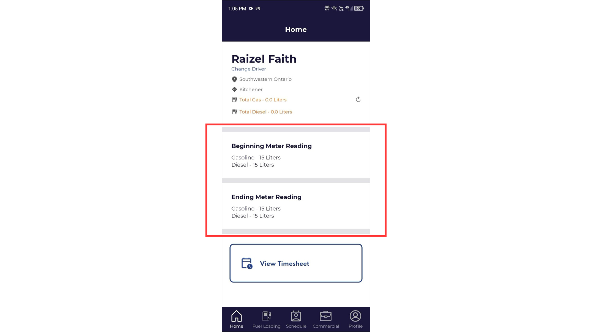

**Bug ID:**  REF-2472   
**Severity:** Critical   
**Priority:** High   
**Project:** ReFuel   
**Environment:** Staging   

---

### Title:
Driver App Beginning and Ending Meter Auto-Fill Issue

### Description:
Ending meter auto-populates with beginning meter value incorrectly.

### Steps to Reproduce:
1. Login to Mobile Driver App
2. Input beginning meter
3. Click Submit
4. Observe ending meter

### Expected Result:
Ending meter should be empty or separately inputted.

### Actual Result:
Ending meter auto-fills with beginning meter value.

### Evidence:

