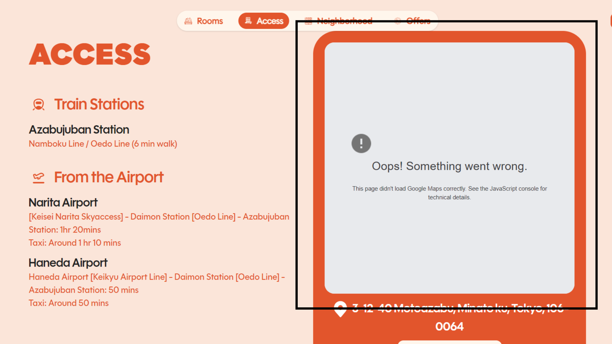

## Bug ID:
SECL-001

## Title:
[Properties Page | Access Section] Map widget fails to load due to JavaScript console error

## Project:
Section-L 

## Environment:
Device: Desktop
OS: Windows 11 
Browser: Chrome 

## Severity:
High

## Priority:
High

## Steps to Reproduce:
1. Open Sec-L website
2. Navigate to sidebar
3. Go to any under properties
4. Click on navbar to Access
5. Observe the map widget behavior
6. Open browser DevTools → Console tab

## Expected Result:
Map widget should load correctly and display property location without errors.

## Actual Result:
Map widget fails to load. The section remains blank or unresponsive, and a JavaScript error appears in the browser console.

## Evidence:

## Notes:
- Issue appears related to JavaScript execution failure during map initialization
- Reproducible across multiple page refreshes
