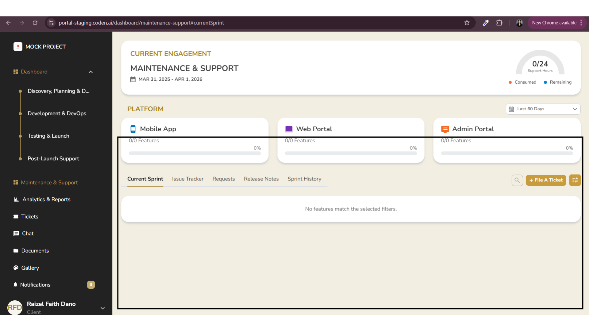

**Bug ID:** CPN-0001  
**Severity:** High  
**Priority:** High  
**Project:** Coden Portal  
**Environment:** Staging

---

### Title:
[Maintenance & Support | Current Sprint] No Tickets Displayed for Current Sprint 

### Description:
In the Maintenance & Support module under the Current Sprint view, the system does not display any tickets even when valid sprint data is expected to be available. This affects visibility of active sprint information and may mislead users into thinking no records exist.

### Steps to Reproduce:
1. Open Coden Portal in staging environment.  
2. Navigate to Maintenance & Support.  
3. Select Current Sprint.  
4. Ensure there are existing sprint records for the selected timeframe.  
5. Observe the displayed data state.  

### Expected Result:
System should display all available sprint data relevant to the selected Current Sprint filter.

### Actual Result:
System displays no tickets despite the presence of valid sprint data.

### Evidence:

### Notes:
Issue may be related to incorrect filtering logic, API response handling, or date/sprint mismatch between frontend and backend data retrieval.
