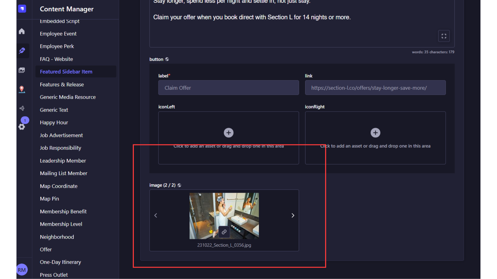
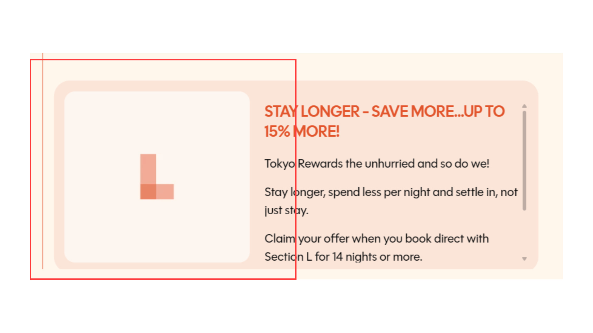

**Bug ID:** SECL-430  
**Severity:** Medium  
**Priority:** Medium  
**Project:** Section-L  
**Environment:** Pre-production  

---

### Title:
[Featured Sidebar Item | Image Not Displaying] Featured Item Shows Placeholder Instead of CMS Image

### Description:
The Featured Sidebar Item is not displaying the intended image configured in Strapi CMS. Although an image is uploaded and assigned to the featured item in CMS, the website displays the default placeholder graphic instead of the selected image.

### Steps to Reproduce:
1. Open the Section-L platform in pre-production environment.  
2. Navigate to sidebar
3. Locate the Featured Sidebar Item
4. Observe the displayed image
5. Verify the assigned image in Strapi CMS

### Expected Result:
The Featured Sidebar Item should display the image configured and uploaded in Strapi CMS.

### Actual Result:
The Featured Sidebar Item displays the default placeholder image even though an image is assigned in Strapi CMS.

### Evidence:

### Notes:
- Placeholder fallback may be overriding the CMS-provided image
- Frontend may not be properly fetching the image data from CMS
