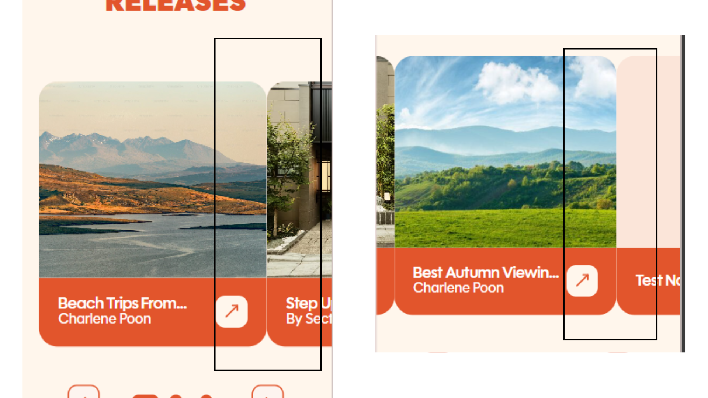

**Bug ID:** SECL-0432  
**Severity:** Low  
**Priority:** Medium  
**Project:** Section-L   
**Environment:** Pre-production - Mobile

---

### Title:
[Media Page | Press Releases] Improper Spacing Between Carousel Cards

### Description:
In the Media Page, the carousel component on Press Releases does not display proper spacing between cards. The cards appear too close to each other and do not match the intended design specifications, affecting visual clarity and UI consistency.

### Steps to Reproduce:
1. Open the Section-L on mobile, preprod environment.
2. Navigate to sidebar.  
3. Click on Media.
4. Scroll through the Press Releases carousel section.  
5. Observe the spacing between individual cards.  

### Expected Result:
Carousel cards should maintain consistent spacing between each item as defined in the design specifications.

### Actual Result:
Carousel cards are displayed without proper spacing, causing them to appear tightly packed and inconsistent with the intended UI design.

### Evidence:

### Notes:
Issue is likely related to layout spacing properties (e.g., margin, gap, or padding configuration in the carousel container).
