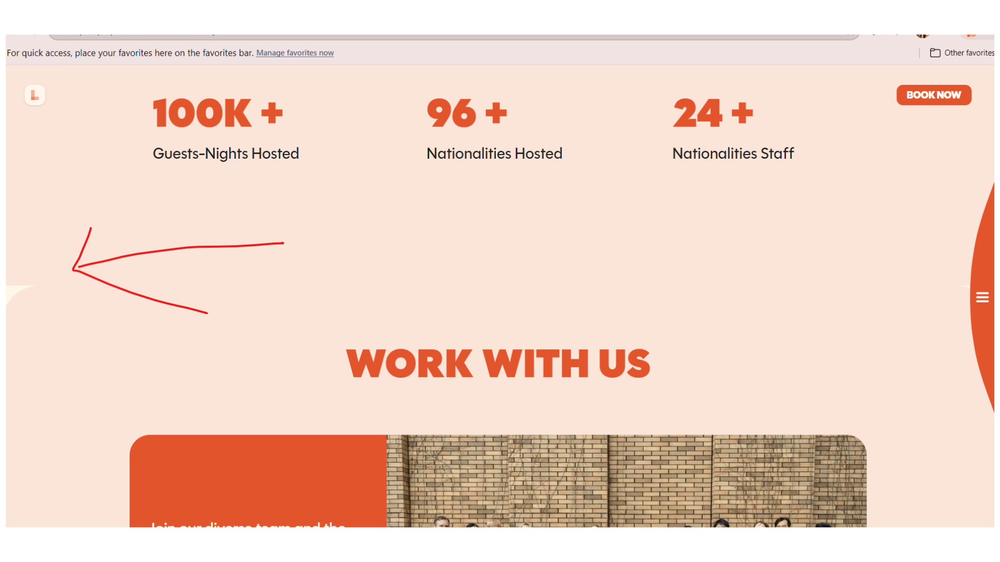

**Bug ID:** SECL-647
**Severity:** Low  
**Priority:** Medium  
**Project:** Section-L  
**Environment:** Pre-production  

---

### Title:
Background Sections Not Rendering Separately per Section

### Description:
On the Business Development page, the background container overlaps with page content sectionsInstead of displaying distinct background colors for each content block, the background appears to overlap or merge across sections, reducing visual separation between UI components.

### Steps to Reproduce:
1. Open the Section-L in pre-production.
2. Navigate to sidebar.
3. Click on the Business Development page.
4. Scroll through the page content.
5. Observe layout rendering of background container.

### Expected Result:
Each section should display its intended background color independently, maintaining clear visual separation between content blocks.

### Actual Result:
Background container overlaps with page content, causing layout misalignment and affecting visual clarity.

### Evidence:

### Notes:
Issue likely related to CSS section styling or container hierarchy affecting background rendering between stacked components.
